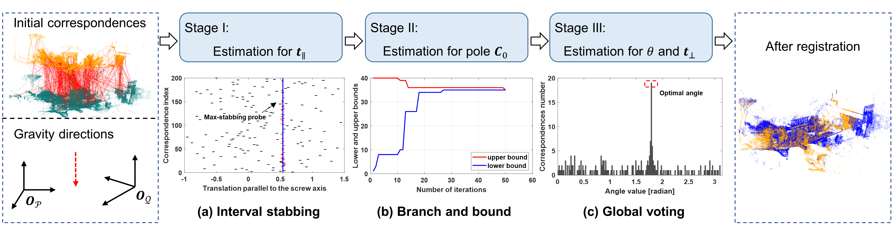

# Transformation Decoupling Strategy Based on Screw Theory for Deterministic Point Cloud Registration With Gravity Prior 
<p align="left">
[<a href="https://ieeexplore.ieee.org/document/10634827">Paper</a>] 
</p>

## Overview

This repository provides an example implementation of a deterministic point cloud registration algorithm based on screw theory and gravity prior constraints. The method is particularly suitable for tasks requiring accurate and robust 3D alignment, and it decouples rotational and translational components to improve stability and efficiency.

We provide synthetic demo for applying the algorithm to correspondences generated by arbitrary point clouds.

<div align="center">
  
</div>


## Usage
### Demo Usage (Synthetic Data)
1.	Run example_4DoF.m using MATLAB.
2.	The script will:
	• Generate two 3D point clouds using Gaussian noise and configurable outlier rates.
	• Apply the proposed registration method.
	• Output the estimated rotation and translation and compare with the ground truth.

### Custom Data
To apply the method to your own point cloud data:
    • Prepare two correspondences data generated by two point clouds data_x and data_y as 3×N matrices.
    • These represent corresponding points from source and target clouds respectively.
    • Call:
```
[R_opt, t_opt, cost_time, ~, ~] = dof4_reg(data_x, data_y, noise_level);
```

Refer to the demo script for usage patterns and helper functions.

## Directory Structure
```
├── functions/              # Core algorithm and helper utilities
├── example_4DoF.m          # Demo scripts for synthetic data generation and registration
├── main_fig.png            # Main pipeline illustration of our method
├── LICENSE                 # MIT License
└── README.md               # Project overview and usage
```

## Citation

If you find our method useful in your research or projects, please consider citing our work:
```
@article{li2024transformation,
  title={Transformation Decoupling Strategy based on Screw Theory for Deterministic Point Cloud Registration with Gravity Prior},
  author={Li, Xinyi and Ma, Zijian and Liu, Yinlong and Zimmer, Walter and Cao, Hu and Zhang, Feihu and Knoll, Alois},
  journal={IEEE Transactions on Pattern Analysis and Machine Intelligence},
  year={2024},
  publisher={IEEE}
}
```

## Contact

For questions or suggestions, feel free to open an issue or contact us at: {super.xinyi, zijian.ma}@tum.de

This codebase is implemented in MATLAB. If you’re interested in implementing the method in other languages (e.g., Python or C++), contributions are very welcome — feel free to open a Pull Request!
